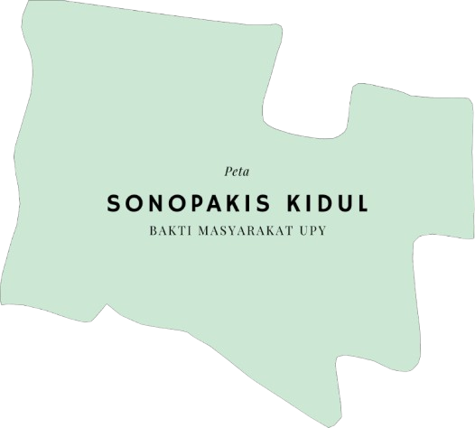

<!DOCTYPE html>
<html lang="id">
<head>
    <meta charset="UTF-8">
    <meta name="viewport" content="width=device-width, initial-scale=1.0">
    <title>SIG Sonopakis Kidul - KKN Ngestiharjo</title>
    
    <link rel="stylesheet" href="https://unpkg.com/leaflet@1.9.4/dist/leaflet.css" />
    
</head>
<body class="bg-gray-50">
    <header class="bg-green-700 text-white py-6 px-4 shadow-md">
        

            

                

                    <h1 class="text-2xl md:text-3xl font-bold">SIG Sonopakis Kidul</h1>
                    
Sistem Informasi Geografis Bakti Masyarakat UPY

                

            

        

    </header>

    <main class="container mx-auto px-4 py-8">
        

            

        

        

            

                <h2 class="text-xl font-semibold text-green-800 mb-4">Daftar RT</h2>
                <ul class="space-y-2" id="rt-list">
                    <!-- Daftar RT akan diisi oleh JavaScript -->
                </ul>
            

            

                <h2 class="text-xl font-semibold text-green-800 mb-4">Fasilitas Publik</h2>
                <ul class="space-y-2" id="facilities-list">
                    <!-- Fasilitas publik akan diisi oleh JavaScript -->
                </ul>
            

            

                <h2 class="text-xl font-semibold text-green-800 mb-4">Gambaran Lingkup Peta</h2>
                
Klik pada marker untuk melihat informasi detail lokasi. Area yang diarsir menunjukkan batas wilayah Sonopakis Kidul.

                
            

        

    </main>

    <footer class="bg-gray-800 text-white py-6 mt-8">
        

            
© 2025 Kelompok Bakti Masyarakat Upy - Sonopakis Kidul

            
Dikembangkan untuk mendukung sistem informasi wilayah

        

    </footer>

    
    
</body>
</html>
